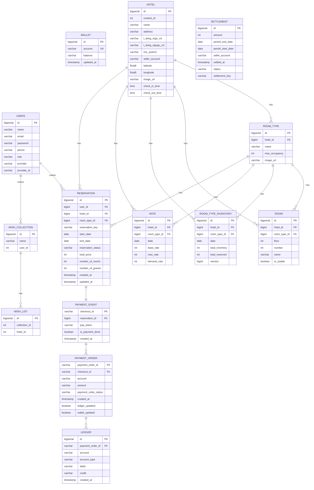

# ERD

모든 Entity 에는 생성 시간과 수정 시간을 관리하기 위한 공통 필드가 존재합니다.
ERD 에선 생략하였습니다.

```mermaid
erDiagram
    RESERVATION {
        bigserial id PK
        bigint user_id FK
        bigint hotel_id FK
        bigint room_type_id FK
        varchar reservation_key
        date start_date
        date end_date
        varchar reservation_status
        int total_price
        int number_of_rooms
        int number_of_guests
        timestamp created_at
        timestamp updated_at
    }

  PAYMENT_EVENT {
    varchar checkout_id PK
    bigint reservation_id FK
    varchar psp_token
    boolean is_payment_done
    timestamp created_at
  }

  PAYMENT_ORDER {
    varchar payment_order_id PK
    varchar checkout_id FK
    varchar account
    varchar amount
    varchar payment_order_status
    timestamp created_at
    boolean ledger_updated
    boolean wallet_updated
  }

  WALLET {
    bigserial id PK
    varchar account UK
    varchar balance
    timestamp updated_at
  }

  LEDGER { 
    bigserial id PK
    varchar payment_order_id FK
    varchar account
    varchar account_type
    varchar debit
    varchar credit
    timestamp created_at
  }

  
      USERS {
        bigserial id PK
        varchar name
        varchar email
        varchar password
        varchar phone
        varchar role
        varchar provider
        varchar provider_id
    }

    HOTEL {
        bigserial id PK
        int content_id
        varchar name
        varchar address
        varchar l_dong_regn_cd
        varchar l_dong_signgu_cd
        varchar lcls_systm2
        varchar seller_account
        float8 latitude
        float8 longitude
        varchar image_url
        time check_in_time
        time check_out_time
    }

    ROOM_TYPE {
        bigserial id PK
        bigint hotel_id FK
        varchar name
        int max_occupancy
        varchar image_url
    }

    ROOM {
        bigserial id PK
        bigint hotel_id FK
        bigint room_type_id FK
        int floor
        int number
        varchar name
        boolean is_usable
    }

    ROOM_TYPE_INVENTORY {
        bigserial id PK
        bigint hotel_id FK
        bigint room_type_id FK
        date date
        int total_inventory
        int total_reserved
        bigint version
    }

    RATE {
        bigserial id PK
        bigint hotel_id FK
        bigint room_type_id FK
        date date
        int base_rate
        int max_rate
        int demand_rate
    }
    
    WISH_COLLECTION{
	    bigserial id PK
	    varchar name
	    int user_id
    }
    
    WISH_LIST{
	    bigserial id PK
	    int collection_id
	    int hotel_id
    }
    
    SETTLEMENT{
	    bigserial id PK
	    int amount
	    date period_end_date
	    date period_start_date
	    varchar seller_account
	    timestamp settled_at   
		  varchar status
		  varchar settlement_key	   
		}
   

    HOTEL ||--o{ ROOM_TYPE : has
    HOTEL ||--o{ ROOM : has
    HOTEL ||--o{ ROOM_TYPE_INVENTORY : has
    HOTEL ||--o{ RATE : has
    HOTEL ||--o{ RESERVATION : has
    ROOM_TYPE ||--o{ ROOM : has
    ROOM_TYPE ||--o{ ROOM_TYPE_INVENTORY : has
    ROOM_TYPE ||--o{ RATE : has
    ROOM_TYPE ||--o{ RESERVATION : has
    USERS ||--o{ RESERVATION : makes
    USERS ||--o{ WISH_COLLECTION : makes
    WISH_COLLECTION ||--o{ WISH_LIST : has

  RESERVATION ||--|| PAYMENT_EVENT : ""
  PAYMENT_EVENT ||--o{ PAYMENT_ORDER : ""
  PAYMENT_ORDER ||--o{ LEDGER : ""
```
