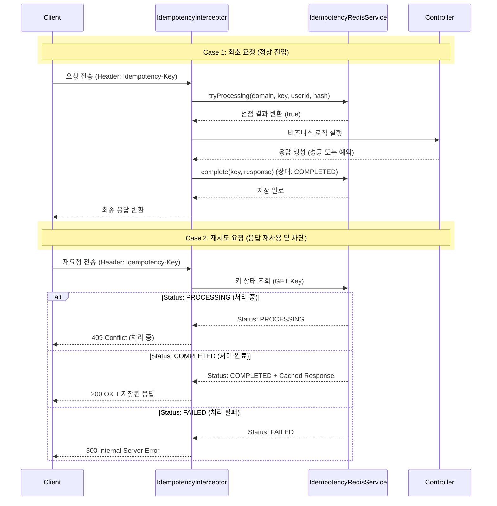
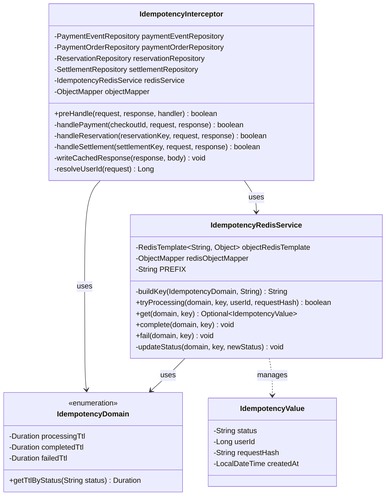

## Redis 멱등키 TTL 전략

| 도메인 | 상태 (Status) | TTL | 비고 / 설정 사유 |
| :--- | :--- | :--- | :--- |
| **예약** | `processing` | 1분 | 동시 요청 선점 및 처리 대기 |
| | `completed` | 10분 | 임시 예약 유효 기간(10분)과 동기화 |
| | `failed` | 1분 | 실패 건에 대한 빠른 재시도 허용 |
| **결제** | `processing` | 1분 | 외부 PG 통신 대기 |
| | `completed` | 30분 | 결제 승인 응답 재사용 및 결과 보존 |
| | `failed` | 1분 | 실패 건에 대한 빠른 재시도 허용 |
| **정산 수동 처리** | `processing` | 1분 | 수동 정산 중복 실행 방지 |
| | `completed` | 1일 | 당일 중복 정산 요청 원천 차단 |
| | `failed` | 1분 | 실패 건에 대한 빠른 재시도 허용 |

## 멱등키 흐름

## 클래스 다이어그램

