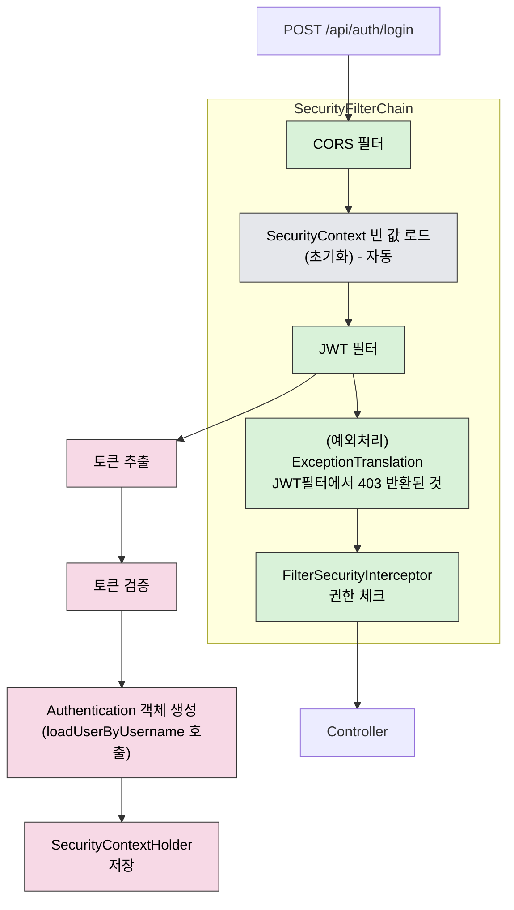
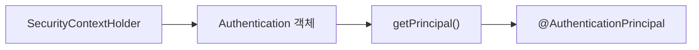

## JWT 인증/인가 흐름

## Authentication 객체에서 유저 정보 추출

## JWT 전략
### 1. 토큰 저장 전략

| 구분 | 저장 위치 | 이유 |
| --- | --- | --- |
| Access Token | 메모리 (변수) | localStorage 저장 시 XSS 공격으로 탈취 가능 → 메모리에 저장해 JS 접근 차단 |
| Refresh Token | httpOnly 쿠키 | JS로 접근 불가 → XSS 방어, 브라우저가 요청 시 자동 전송 |

---

### 2. 재발급 전략 - RTR 방식

> RT는 재발급시 AT,RT 재발급
> 

| 상황 | 처리 방식 |
| --- | --- |
| 새로고침 / 브라우저 재시작 | `useEffect`에서 `/reissue` 자동 호출 → AT+RT 재발급 |
| AT 만료 | axios interceptor 401 감지 → `/reissue` → AT+RT재발급 → 이전 요청 재시도 |
| RT 만료 | `/reissue` 실패 감지 → 로그인 페이지로 이동 |

---

### 3. Redis 전략

| 구분 | key | value | TTL |
| --- | --- | --- | --- |
| RT 저장 | `"RT:{userId}"` | `refreshToken` | `7일` |
| 블랙리스트 | `"BL:{accessToken}"` | `"logout"` | `AT 남은 만료시간` |
