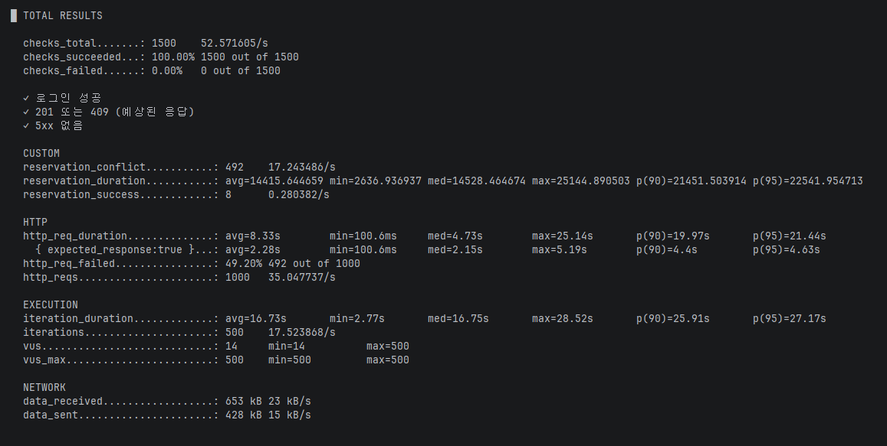
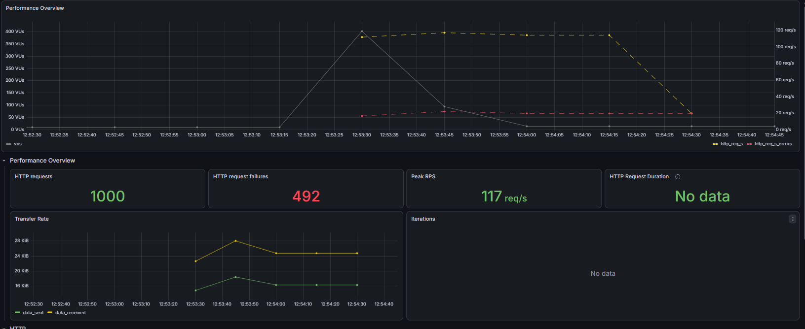

# 부하 테스트 대상 선정 및 목적
 
## 1. 개요
 
### 목적
 
호텔 객실 예약 서비스의 **재고 동시성 제어(낙관적 락) 정합성**을 부하 테스트를 통해 검증합니다

### 배경
동일 객실·동일 날짜에 다수의 사용자가 동시에 예약을 시도할 경우, 재고 수량 이상으로 예약이 성립되면 안 됩니다. 본 프로젝트는 이를 방지하기 위해 **낙관적 락** 기반의 동시성 제어를 적용했으며, 
실제 대량 동시 요청 상황에서 이 제어가 의도대로 동작하는지 사전 검증이 필요합니다.

## 2. 테스트 목표
 
1. 동일 객실에 대한 동시 예약 요청 시 **재고 수량만큼만 예약이 성립**하는지 검증 (락 정합성).
2. 다음 지표 측정:
   - 응답 시간 (Response Time, p95 기준)
   - 오류율 (로그인 실패율, 5xx 발생 여부, 타임아웃 비율)
   - 처리량 (초당 요청 수)

## 3. 테스트 범위
 
### 재고 동시성 시나리오

1. 동일 객실·동일 날짜에 다수 사용자가 동시에 예약을 요청.
2. 재고 수량만큼만 `201 성공`, 나머지는 `409 Conflict`로 처리되는지 확인.

## 4. 테스트 환경
 
### 4-1. 테스트 도구
- 부하테스트 : k5 
- 모니터링 : Prometheus + Grafana (k6 Prometheus remote-write)

### 4-2. 자동화 구현 
Prometheus를 선택한 이유
Prometheus는 Grafana와의 프로비저닝 기능을 통해 데이터 소스 및 대시보드를 자동으로 구성할 수 있다는 장점이 있습니다. 이를 통해 복잡한 설정 과정을 생략하고 효율적으로 모니터링 환경을 구축할 수 있었습니다

- 데이터소스 등록: Prometheus를 Grafana 데이터 소스로 등록하고 필요한 대시보드를 코드로 정의
- 대시보드 구성: 응답 시간, 요청 처리량, 에러율 등의 주요 메트릭을 중심으로 시각화


### 5.테스트 실행
 
#### 목적
- 재고 수량을 초과하는 동시 예약이 성립되지 않는지 검증.
- 서버의 응답 속도와 오류율 측정.

#### 설정
 
- **가상 사용자 수(VUs): 1,000명
- **테스트 시간:** 최대 30초 (`maxDuration`)
- **성공 기준(threshold):** `p(95) < 5000ms` 

#### k6 스크립트
 
```javascript
import http from 'k6/http'
import { check } from 'k6'
import { Counter, Trend } from 'k6/metrics'
import { uuidv4 } from 'https://jslib.k6.io/k6-utils/1.4.0/index.js'
 
const BASE_URL = __ENV.BASE_URL || 'http://localhost:8080/api/v1'
 
const successCount = new Counter('reservation_success')
const conflictCount = new Counter('reservation_conflict')
const otherFailCount = new Counter('reservation_other_fail')
const reservationDuration = new Trend('reservation_duration')

export const options = {
    scenarios: {
        concurrent_same_room: {
            executor: 'shared-iterations',
            vus: 500,
            iterations: 500,
            maxDuration: '30s',
        },
    }
}
 
// 테스트 대상 객실 (재고 수량과 반드시 일치 확인 후 실행)
const TARGET_HOTEL_ID = 1
const TARGET_ROOM_TYPE_ID = 4
const CHECK_IN = '2026-08-14'
const CHECK_OUT = '2026-08-15'
const RESERVE_GUEST = 2
const RESERVE_ROOM = 1
 
export default function () {
    const vuId = __VU
 
    // 1) 로그인
    const loginRes = http.post(
        `${BASE_URL}/auth/login`,
        JSON.stringify({
            email: `user${vuId}@example.com`,
            password: 'asd798852',
        }),
        { headers: { 'Content-Type': 'application/json' } }
    )
 
    check(loginRes, {
        '로그인 성공': (r) => r.status === 200,
    })
 
    const token = loginRes.json('accessToken')
    if (!token) {
        console.error(`VU ${vuId} - 로그인 실패: status=${loginRes.status}, body=${loginRes.body}`)
        return
    }
 
    // 2) 예약 요청
    const idempotencyKey = uuidv4()
 
    const reservationPayload = JSON.stringify({
        hotelId: TARGET_HOTEL_ID,
        roomTypeId: TARGET_ROOM_TYPE_ID,
        startDate: CHECK_IN,
        endDate: CHECK_OUT,
        numberOfGuests: RESERVE_GUEST,
        numberOfRooms: RESERVE_ROOM,
    })
 
    const reservationRes = http.post(`${BASE_URL}/reservations`, reservationPayload, {
        headers: {
            'Content-Type': 'application/json',
            'Authorization': `Bearer ${token}`,
            'Idempotency-Key': idempotencyKey,
        },
    })

    reservationDuration.add(reservationRes.timings.duration)
 
    // 3) 결과 분류
    if (reservationRes.status === 201) {
        successCount.add(1)
    } else if (reservationRes.status === 409) {
        conflictCount.add(1) // 재고부족(RESERVATION_UNAVAILABLE) 또는 재시도소진(RESERVATION_CONFLICT)
    } else {
        otherFailCount.add(1)
        console.error(`VU ${vuId} - 예상 밖 응답: ${reservationRes.status} - ${reservationRes.body}`)
    }
 
    check(reservationRes, {
        '201 또는 409 (예상된 응답)': (r) => r.status === 201 || r.status === 409,
        '5xx 없음': (r) => r.status < 500
    })
}
```




### 6. 부하 테스트 결과 분석


 - Error Rate: (총 492건 실패)
 - 재고 8개 중 500개의 동시요청에서 8개가 성공하고 나머지 492건이 409에러를 내는 결과를 도출했습니다

재고 수량과 성공 건수가 정확히 일치 
→ 동시성 제어(락)가 정상 동작하고 있음을 확인했습니다 초과 요청은 모두 409로 거부되어 예상치 못한 에러가 없습니다

p95 응답시간(테스트 데이터 3만건): 
reservation_duration: med=14528ms, p90=21451ms, p95=22541ms, max=25144ms
같은 객실에 예약 500건이 동시 요청 시 DB 락 경합으로 응답 지연이 발생
→ 이는 정합성(락)과 응답속도 간의 트레이드오프로 기록했습니다

