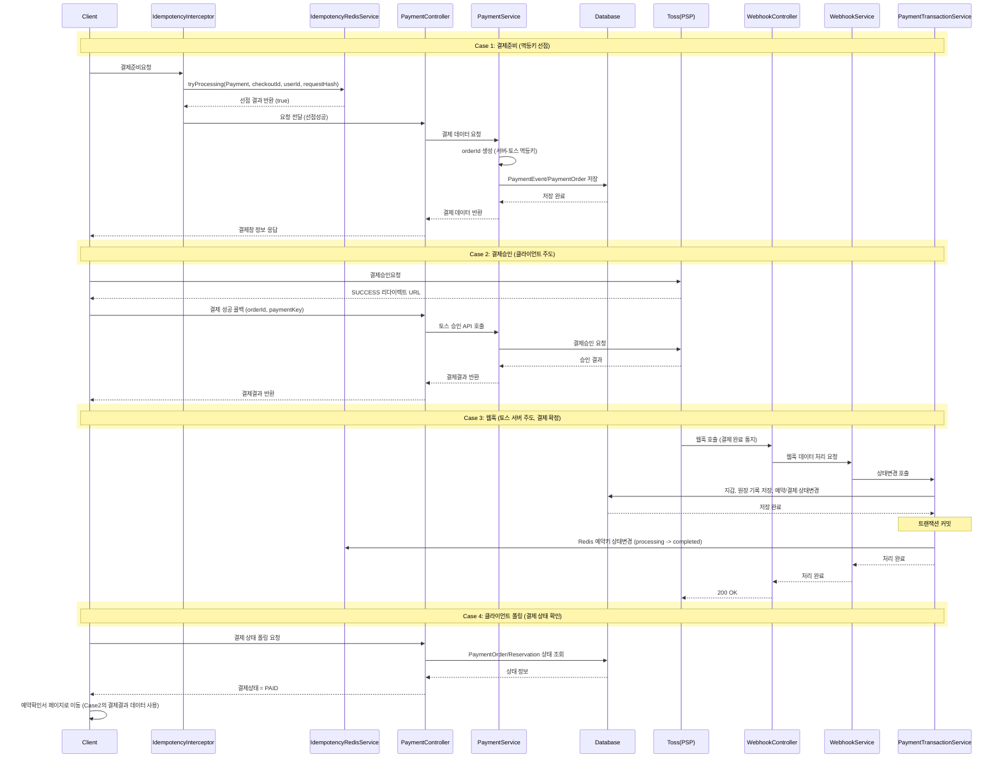
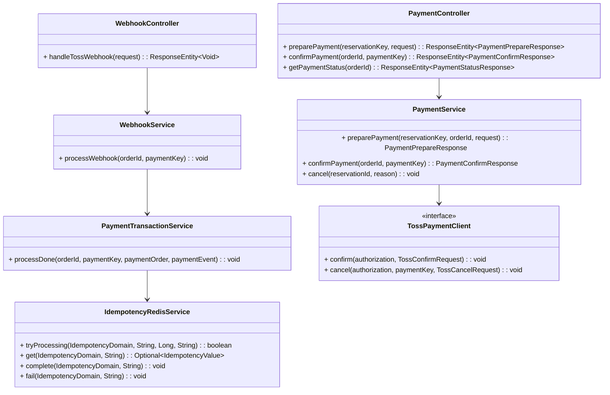

## 결제처리 흐름

```mermaid
sequenceDiagram
    participant Client as Client
    participant IT as IdempotencyInterceptor
    participant IS as IdempotencyRedisService
    participant PC as PaymentController
    participant PS as PaymentService
    participant DB as Database
    participant Toss as Toss(PSP)
    participant WC as WebhookController
    participant WS as WebhookService
    participant PT as PaymentTransactionService

    rect rgb(255, 249, 196)
        Note over Client, PT: Case 1: 결제준비 (멱등키 선점)
    end
    Client->>IT: 결제준비요청
    IT->>IS: tryProcessing(Payment, checkoutId, userId, requestHash)
    IS-->>IT: 선점 결과 반환 (true)
    IT->>PC: 요청 전달 (선점성공)
    PC->>PS: 결제 데이터 요청
    PS->>PS: orderId 생성 (서버-토스 멱등키)
    PS->>DB: PaymentEvent/PaymentOrder 저장
    DB-->>PS: 저장 완료
    PS-->>PC: 결제 데이터 반환
    PC-->>Client: 결제창 정보 응답

    rect rgb(255, 249, 196)
        Note over Client, PT: Case 2: 결제승인 (클라이언트 주도)
    end
    Client->>Toss: 결제승인요청
    Toss-->>Client: SUCCESS 리다이렉트 URL
    Client->>PC: 결제 성공 콜백 (orderId, paymentKey)
    PC->>PS: 토스 승인 API 호출
    PS->>Toss: 결제승인 요청
    Toss-->>PS: 승인 결과
    PS-->>PC: 결제결과 반환
    PC-->>Client: 결제결과 반환

    rect rgb(255, 249, 196)
        Note over Client, PT: Case 3: 웹훅 (토스 서버 주도, 결제 확정)
    end
    Toss->>WC: 웹훅 호출 (결제 완료 통지)
    WC->>WS: 웹훅 데이터 처리 요청
    WS->>PT: 상태변경 호출
    PT->>DB: 지갑, 원장 기록 저장, 예약/결제 상태변경
    DB-->>PT: 저장 완료
    Note over PT: 트랜잭션 커밋
    PT->>IS: Redis 예약키 상태변경 (processing -> completed)
    PT-->>WS: 처리 완료
    WS-->>WC: 처리 완료
    WC-->>Toss: 200 OK

    rect rgb(255, 249, 196)
        Note over Client, PT: Case 4: 클라이언트 폴링 (결제 상태 확인)
    end
    Client->>PC: 결제 상태 폴링 요청
    PC->>DB: PaymentOrder/Reservation 상태 조회
    DB-->>PC: 상태 정보
    PC-->>Client: 결제상태 = PAID
    Client->>Client: 예약확인서 페이지로 이동 (Case2의 결제결과 데이터 사용)
```

## 클래스다이어그램

```mermaid
classDiagram
    class WebhookController {
        + handleTossWebhook(request): ResponseEntity~Void~
    }

    class PaymentController {
        + preparePayment(reservationKey, request): ResponseEntity~PaymentPrepareResponse~
        + confirmPayment(orderId, paymentKey): ResponseEntity~PaymentConfirmResponse~
        + getPaymentStatus(orderId): ResponseEntity~PaymentStatusResponse~
    }

    class PaymentService {
        + preparePayment(reservationKey, orderId, request): PaymentPrepareResponse
        + confirmPayment(orderId, paymentKey): PaymentConfirmResponse
        + cancel(reservationId, reason): void
    }

    class WebhookService {
        + processWebhook(orderId, paymentKey): void
    }

    class PaymentTransactionService {
        + processDone(orderId, paymentKey, paymentOrder, paymentEvent): void
    }

    class TossPaymentClient {
        <<interface>>
        + confirm(authorization, TossConfirmRequest): void
        + cancel(authorization, paymentKey, TossCancelRequest): void
    }

    class IdempotencyRedisService {
        + tryProcessing(IdempotencyDomain, String, Long, String): boolean
        + get(IdempotencyDomain, String): Optional~IdempotencyValue~
        + complete(IdempotencyDomain, String): void
        + fail(IdempotencyDomain, String): void
    }

    PaymentController --> PaymentService
    PaymentService --> TossPaymentClient
    WebhookController --> WebhookService
    WebhookService --> PaymentTransactionService
    PaymentTransactionService --> IdempotencyRedisService
```
