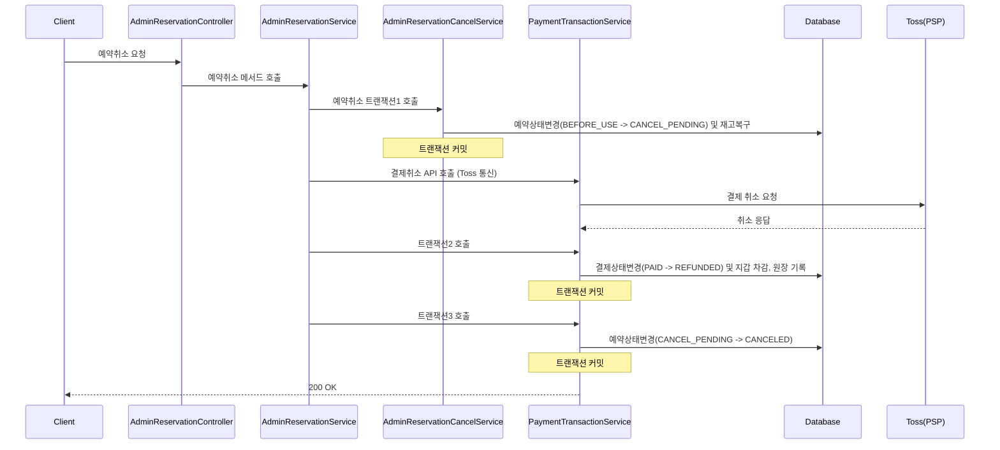
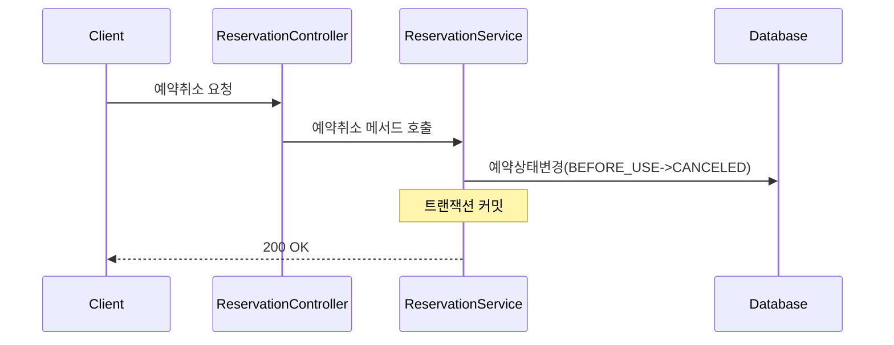

## 1. 예약 취소처리 흐름 -관리자

### 1-1. 트랜잭션 분리 아키텍처

| 구분 | 주요 수행 작업 | 데이터 상태 변화 | 트랜잭션 분리 사유 및 효과 |
| :--- | :--- | :--- | :--- |
| **TX 1** *(예약 선점)* | • 예약 상태 선점 • 예약 재고(Stock) 즉시 원복 | **Reservation**: `BEFORE_USE` &rarr; `CANCEL_PENDING` | 외부 PG API 호출 전 예약을 취소 대기(`CANCEL_PENDING`) 상태로 고정하여 **동시성 이슈(이중 취소 요청 등) 방지** |
| **External API** *(PG 통신)* | • Toss PSP 결제 취소 API 호출 | - | **DB 트랜잭션 외부에서 실행.** 외부 Network Delay로 인한 HikariCP Connection Pool 고갈 예방 |
| **TX 2** *(환불 처리)* | • PG 응답 성공 확인 • 결제 상태 변경 • 사용자 지갑 차감 및 원장 기록 | **Payment**: `PAID` &rarr; `REFUNDED` | PG사 환불 성공 응답 수신 후 결제 데이터 및 금융 원장/지갑 상태를 안전하게 갱신 |
| **TX 3** *(취소 확정)* | • 최종 예약 상태 확정 | **Reservation**: `CANCEL_PENDING` &rarr; `CANCELED` | 환불 절차가 최종 완료된 후 예약을 취소 상태로 변경하여 **시스템 간 데이터 원자성(Atomicity) 달성** |

---
## 2. 예약 취소처리 흐름 -사용자

