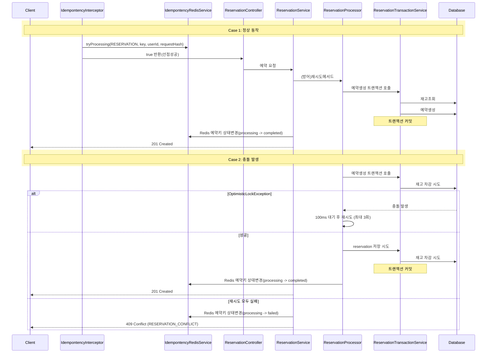
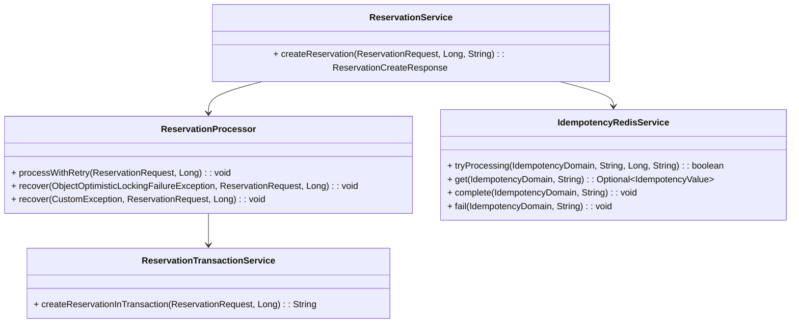

## 예약 생성 흐름

## 재시도 및 트랜잭션 분리 아키텍처

| 구분 | 주요 수행 작업 | 트랜잭션 / 데이터 동작 | 분리 사유 및 핵심 효과 |
| :--- | :--- | :--- | :--- |
| **ReservationProcessor** *(재시도 제어)* | • 백오프 재시도 제어 *(100ms 대기, 최대 3회)* | **`[트랜잭션 없음]`** In-Memory 예외 수집 및 재시도 루프 수행 | 모든 재시도가 한 `@Transactional` 내부에서 돌아가는 것을 방지 |
| **ReservationTransaction Service** *(단일 시도)* | • 재고 조회 및 차감 • 예약 생성 및 저장 | **`[@Transactional 수행]`** | 낙관적 락(`OptimisticLockException`) 발생 시 해당 시도의 단일 트랜잭션만 독립적으로 Rollback. 매 재시도마다 새로운 DB 커넥션을 얻어 최신 DB 재고 상태 조회 |

## 주요 클래스

