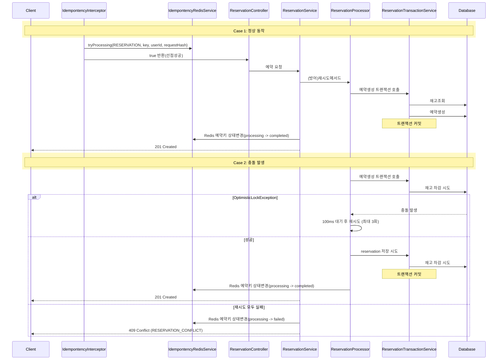
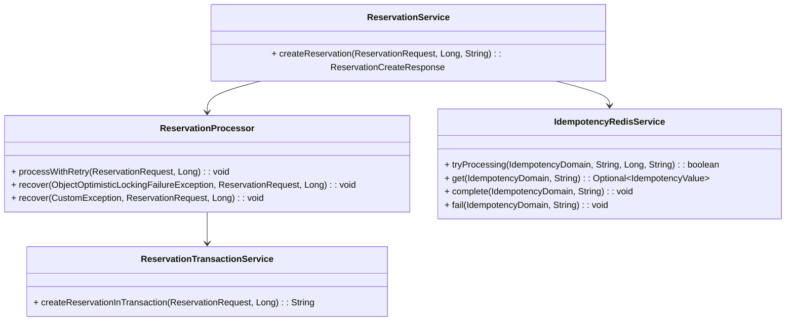

## 예약 생성 흐름

```mermaid
sequenceDiagram
		participant Client as Client
		participant IT as IdempontencyInterceptor
		participant IS as IdempontencyRedisService
		participant RC as ReservationController
    participant RS as ReservationService
    participant RP as ReservationProcessor
    participant RT as ReservationTransactionService
    participant DB as Database
    
    rect rgb(255, 249, 196)
    Note over Client, DB: Case 1: 정상 동작
    end
    IT->>IS: tryProcessing(RESERVATION, key, userId, requestHash)
    IT->>RC: true 반환(선점성공)
    RC->>RS: 예약 요청
    RS->>RP: (방어)재시도메서드
    RP->>RT: 예약생성 트랜잭션 호출
    RT->>DB: 재고조회
    RT->>DB: 예약생성
    note over RT: 트랜잭션 커밋
    RS->>IS: Redis 예약키 상태변경(processing -> completed)
    RS-->>Client: 201 Created
    
    rect rgb(255, 249, 196)
    Note over Client, DB: Case 2: 충돌 발생
    end
    
    RP->>RT: 예약생성 트랜잭션 호출
    RT->>DB: 재고 차감 시도
    alt OptimisticLockException
        DB-->>RP: 충돌 발생
        RP->>RP: 100ms 대기 후 재시도 (최대 3회)
    else 성공
		    RP->>RT: reservation 저장 시도
		    RT->>DB: 재고 차감 시도
        note over RT: 트랜잭션 커밋
        RP->>IS: Redis 예약키 상태변경(processing -> completed)
        RS-->>Client: 201 Created
    else 재시도 모두 실패
		    RS->>IS: Redis 예약키 상태변경(processing -> failed)
        RS-->>Client: 409 Conflict (RESERVATION_CONFLICT)
    end

```

## 주요 클래스

```mermaid
classDiagram
    class ReservationProcessor {
        + processWithRetry(ReservationRequest, Long): void
        + recover(ObjectOptimisticLockingFailureException, ReservationRequest, Long): void
        + recover(CustomException, ReservationRequest, Long): void
    }

    class ReservationService {
        + createReservation(ReservationRequest, Long, String): ReservationCreateResponse
    }

    class ReservationTransactionService {
        + createReservationInTransaction(ReservationRequest, Long): String
    }

    class IdempotencyRedisService {
        + tryProcessing(IdempotencyDomain, String, Long, String): boolean
        + get(IdempotencyDomain, String): Optional~IdempotencyValue~
        + complete(IdempotencyDomain, String): void
        + fail(IdempotencyDomain, String): void
    }

    ReservationService --> ReservationProcessor
    ReservationProcessor --> ReservationTransactionService
    ReservationService --> IdempotencyRedisService
```
