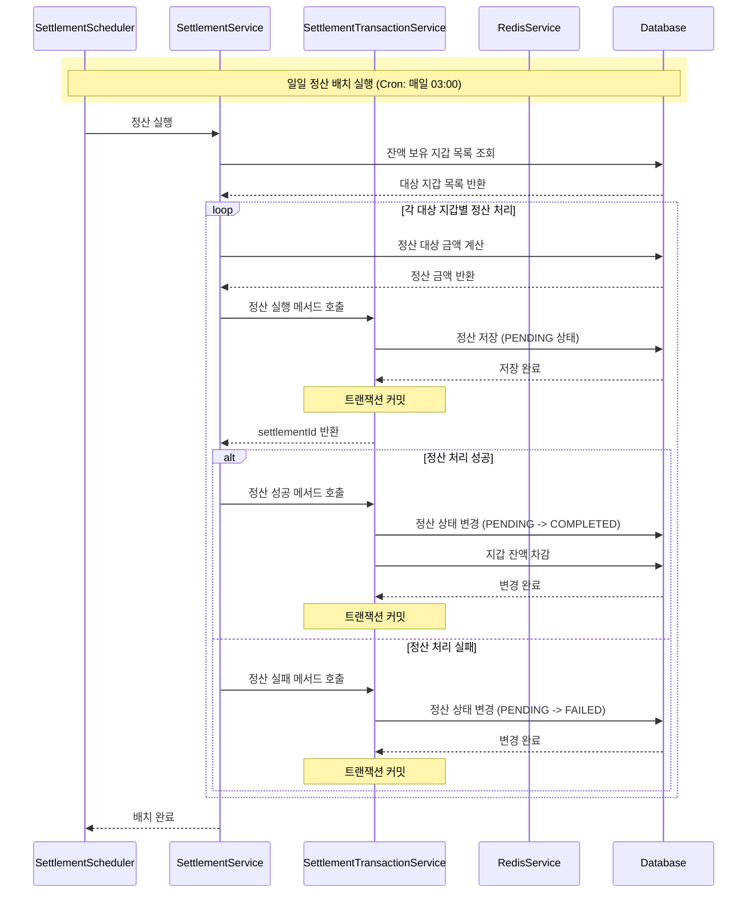
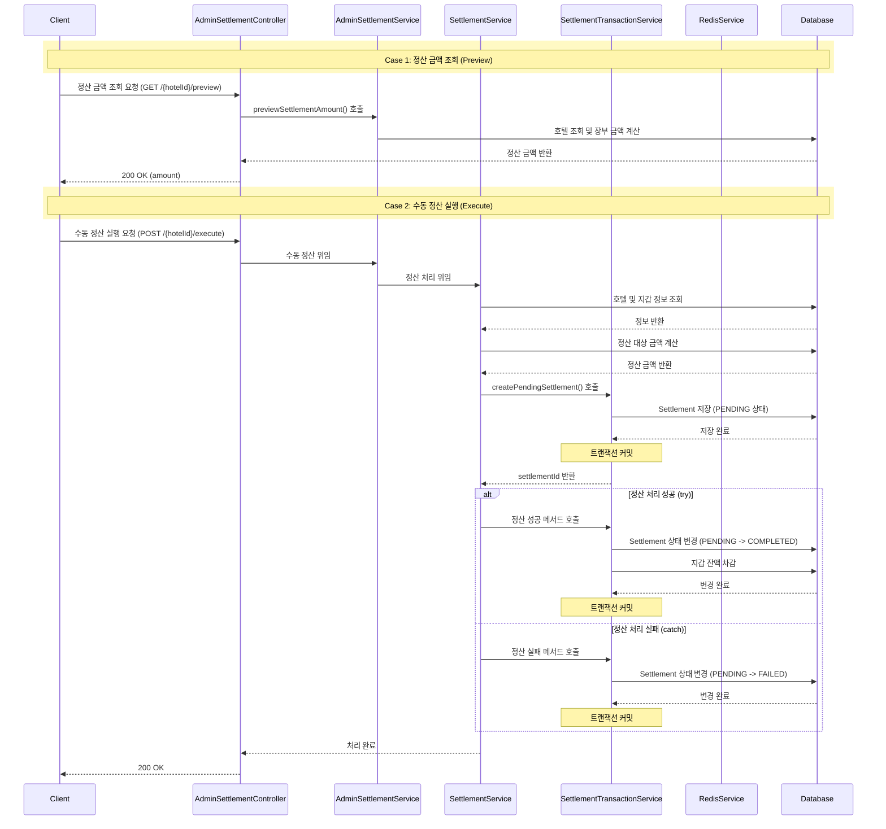

## 일일 정산 배치 흐름

## 정산 수동실행 -관리자

---
### 트랜잭션 분리 아키텍처

| 구분 | 주요 수행 작업 | 트랜잭션 / 데이터 동작 | 분리 사유 및 핵심 효과 |
| :--- | :--- | :--- | :--- |
| **TX 1**  (정산 내역 선점) | • 정산 시도 이력 생성 | **Settlement** 생성 (`PENDING`) | 정산 시작 상태를 독립적으로 먼저 DB에 기록하여 **작업 추적** 및 실패 시 변경할 `settlementId` 반환 |
| **TX 2**  (정산 완료 처리) | • 정산 상태 완료 변경 • 지갑 잔액 차감 | **Settlement** `PENDING`-> `COMPLETED`  DB: 지갑 잔액 차감 | 지갑 잔액 차감과 정산 상태 확정을 **단일 작업 단위로 처리** |
| **TX 3**  (정산 실패 처리) | • 정산 실패 상태 기록 | **Settlement** `PENDING` -> `FAILED`| 예외 발생 시 `PENDING` 건을 실패 상태로 저장하여 **정산 상태 불일치 방지 및 배치 재시도 대상 식별** |

